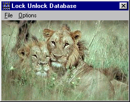



## Lock And Unlock  Access Database

### Description

This code Enables and Disables the Shift Key used to bypass the startup options in Microsoft Access
 
### More Info
 
The only inputs are the Selected database name which is selected from a dialog box

I have included a executable file just in case there are references missing on your machine.

None

The code is completely safe and I have found no side effects

             |
---                |---
**Submitted On**   |2000-11-21 11:13:28
**By**             |[Theophillis](https://github.com/Planet-Source-Code/PSCIndex/blob/master/ByAuthor/theophillis.md)
**Level**          |Intermediate
**User Rating**    |4.0 (8 globes from 2 users)
**Compatibility**  |VB 6\.0
**Category**       |[Complete Applications](https://github.com/Planet-Source-Code/PSCIndex/blob/master/ByCategory/complete-applications__1-27.md)
**World**          |[Visual Basic](https://github.com/Planet-Source-Code/PSCIndex/blob/master/ByWorld/visual-basic.md)
**Archive File**   |[CODE\_UPLOAD1188911212000\.zip](https://github.com/Planet-Source-Code/theophillis-lock-and-unlock-access-database__1-12983/archive/master.zip)

